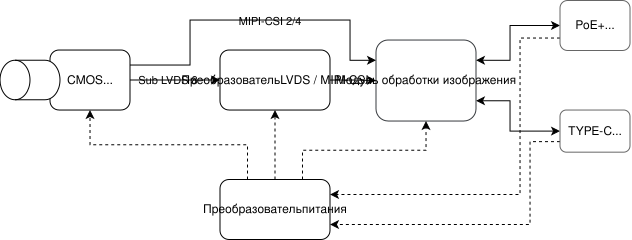

# Параметры модульной камеры

## Спецификация

| Категория | Параметр | Значение / Возможность |
| :--- | :--- | :--- |
| **Процессор** | Архитектура | 8 ядер, 64‑бит: 4×Cortex‑A72 + 4×Cortex‑A63, макс. частота 1.6 ГГц |
| | GPU | Mali‑G52 MC3 @1 ГГц |
| | NPU | 6 TOPS, двухъядерный, поддержка INT4/INT8/INT16/FP16/BF16/TF32 |
| **Оперативная память (RAM)** | Тип и объём | **LPDDR4** (основная); **LPDDR5** — по согласованию с заказчиком, до 32 ГБ/с |
| **Встроенный накопитель** | eMMC / флэш‑память | Система и логи, от 8 ГБ до 128 ГБ (по согласованию с заказчиком) |
| | NVMe SSD | M.2 NVMe диск до 4ТБ — **по согласованию с заказчиком** |
| | Слот microSD | **есть** |
| **Сетевые интерфейсы** | Мультигигабитный Ethernet | до **5 Гбит/с** (возможно комбинированный) |
| | Type‑C SS (SuperSpeed) | до **5 Гбит/с** |
| **Питание** | Основные варианты | **Type‑C Power Delivery** (PD) **или** **PoE+** (по согласованию с заказчиком) |
| **Видео и ISP** | Кодирование | 4K@60fps (H.265/HEVC, H.264/AVC) |
| | Встроенный ISP | 16 Мп, HDR до 120 дБ, AI‑ISP, шумоподавление, поддержка RGB‑IR |
| **Камерный модуль** | Сенсор (референсная модель) | **SONY IMX335** (1/2.8″, 5 Мп) — *фактическая модель по согласованию с заказчиком* |
| | Тип сенсора | **Global Shutter** (глобальный затвор) |
| | Частота кадров | **130-344 fps** - *фактическая величина зависит от устанавливаемого модуля* |
| | Оптика | апертура (F), фокусное расстояние, дисторсия — **зависят от установленного объектива и согласовываются с заказчиком** |
| **Интерфейсы ввода‑вывода** | Ethernet | мультигигабитный до 5 Гбит/с, возможна установка двух портов |
| | RS485 | 1 порт (клеммник) |
| | Type‑C | с поддержкой SuperSpeed (данные) и Power Delivery |
| **Корпус и защита** | Степень защиты | до IP67 (пылевлагонепроницаемый, алюминий с радиатором) |
| | Габариты (Д×Ш×В) | базовые 70 × 70 × 180 мм, фактические определяются по согласованию с заказчиком |
| | Масса | базовая 350 г, фактическая зависит от варианта исполнения и согласовывается с заказчиком |
| **Условия эксплуатации** | Температура | базовая –20 … +50 °C, может быть расширена при необходимости |
| | Влажность | 15 … 90% (без конденсации) |
| **ОС** | Поддерживаемая | Linux 6.11 и выше |

## Структурная схема

## Внешний вид

На рисунке представлен базовый вид камеры. В зависимости от установленного модуля сенсора, объектива и способа крепления, внешний вид может быть изменён:

